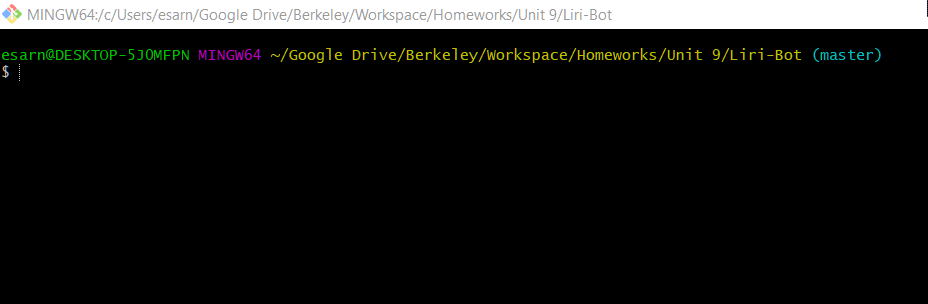
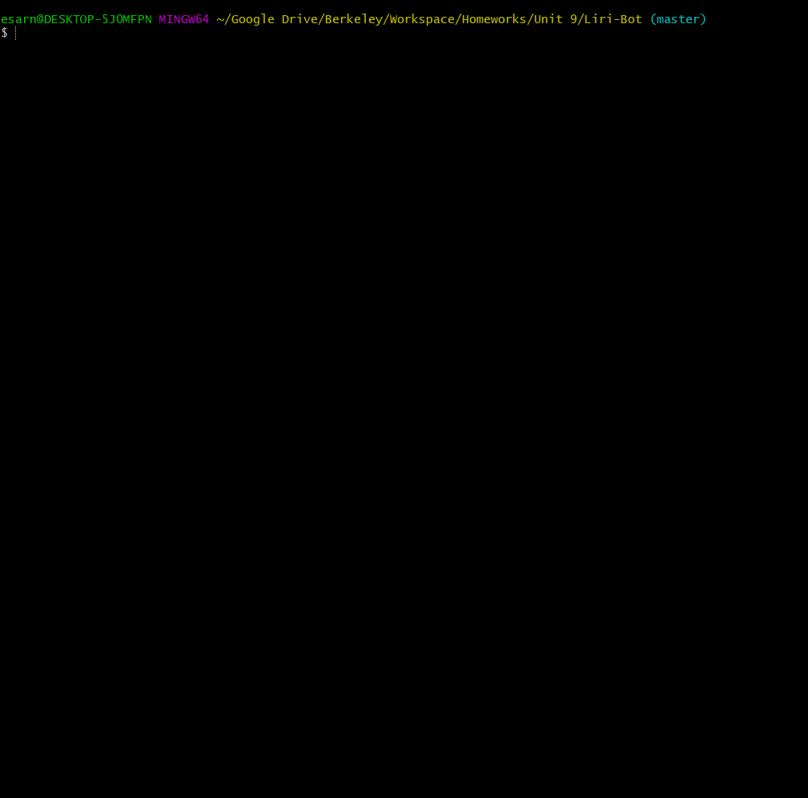
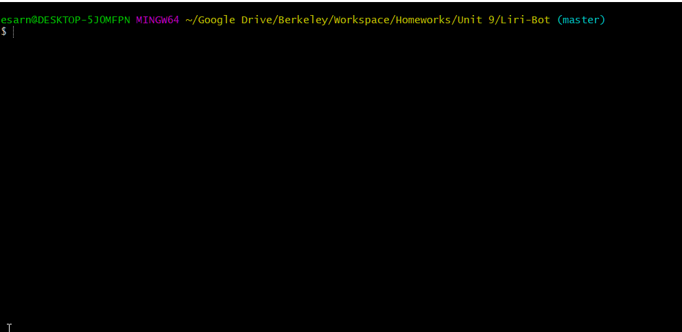

# Liri-node-app

## Demonstration
* Searching for an Artist or Band on BandsInTown:



* Searching for a song on Spotify:



* Searching for a movie on OMDB: 



* Using Random.txt to run all three:


----

Liri-node-app is a Language Interpretation and Recognition Interface through the command line that takes in parameters and gives back data based on a specific command you tell it to do. 

Liri also saves all of it's responses in a log.txt file, including a timestamp of exactly when the command was used.

Liri has a beautiful question design thanks to [Inquirer](https://www.npmjs.com/package/inquirer). We don't talk about the response design, to not hurt Liri's feelings.

To use Liri, you may run `node liri.js`, use arrow keys to move between options, and search for key words after choosing an option.

----

## Getting Started

You will need all of the files in this repository for Liri to work, except for the images. You will also need a .env file to store your spotify app-id and secret so that you can interact with spotify's api. The .env file content looks like this:
```dsconfig
# Spotify API keys

SPOTIFY_ID=ReplaceThisWithYour32DigitKeyHere
SPOTIFY_SECRET=ReplaceThisWithYour32DigitSecretHere

```

## Prerequisites

First (if you do not have git installed on your PC), you will need to install [NodeJS](https://nodejs.org/en/) on your machine. It is recommended you use the LTS version for stability. 

If you have git installed, you may open git bash within this repository folder on your machine. If you installed NodeJS, you may open terminal/CommandPrompt and direct to the repo folder.

Once that is installed, you will need to install a few packages. Luckily there is a package.json ready for you. Here is how you execute it to install packages: 

```xl
npm i 
// or you may do
npm i --save
```
This will create your node_modulus folder with proper dependencies.

## Deployment

To run this on your machine after you setup nodejs and download the repository, you may do `node liri.js` to bring up the application's menu.

----

## Built With

* [Axios*](https://www.npmjs.com/package/axios)
* [DotEnv*](https://www.npmjs.com/package/dotenv)
* [NodeJS*](https://nodejs.org/en/)
* [Inquirer*](https://www.npmjs.com/package/inquirer)
* [Moment*](https://www.npmjs.com/package/moment)
* [Javascript](https://www.w3schools.com/js/)
* [OMDB API](https://www.omdbapi.com/)
* [BandsInTown API](https://rest.bandsintown.com)
* [Node-Spotify-API*](https://www.npmjs.com/package/node-spotify-api)

*These are packages installed by NPM: [Node Package Manager](https://www.npmjs.com/).

## Authors

* **Esar Behlum** 